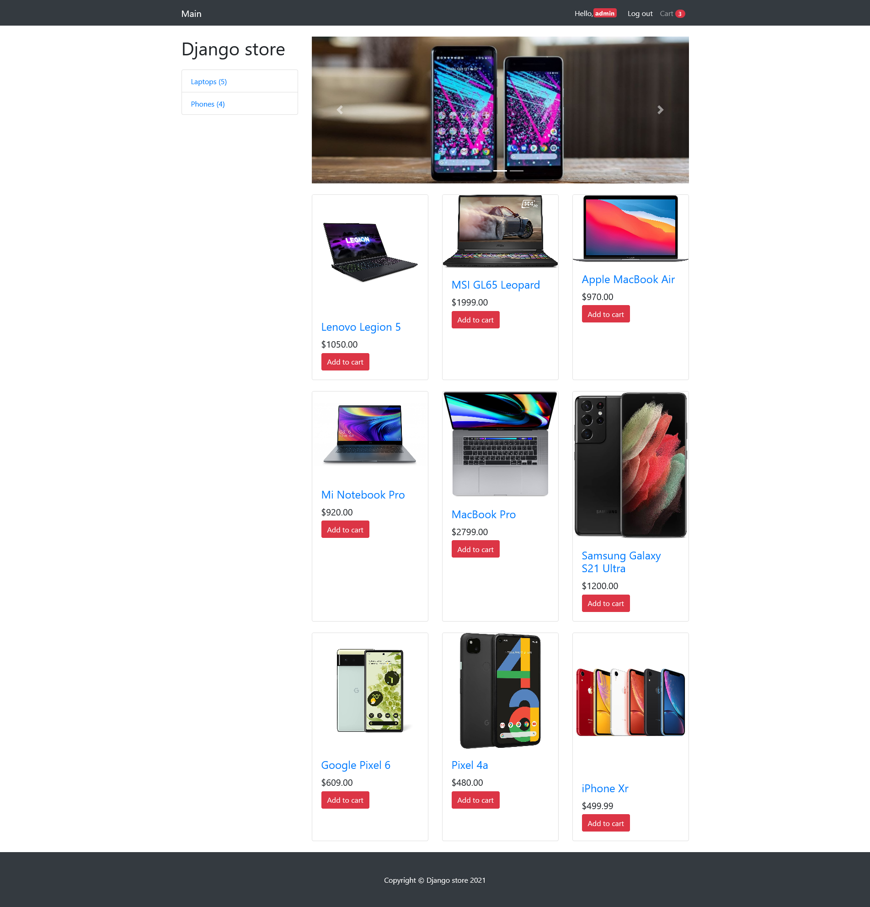
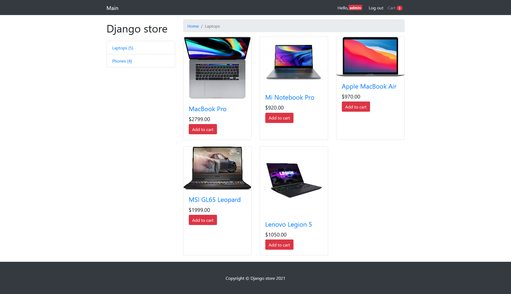
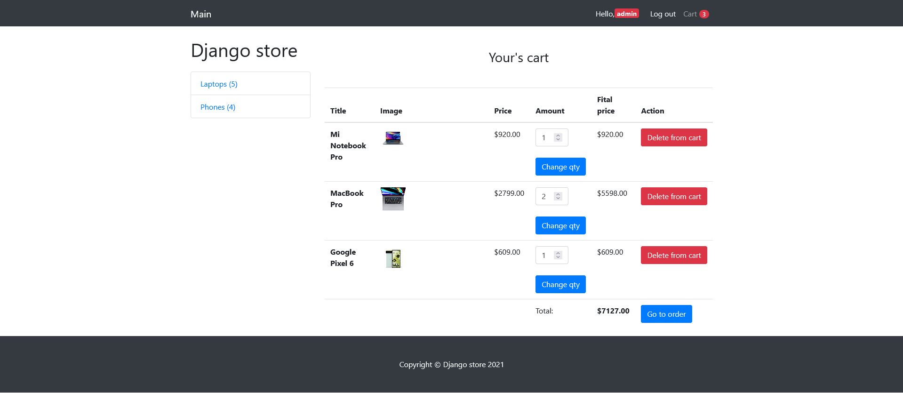
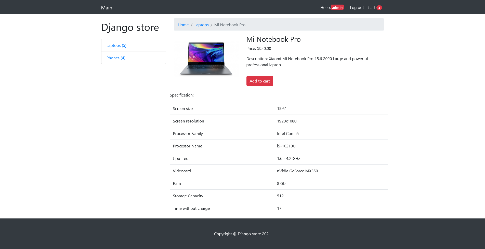
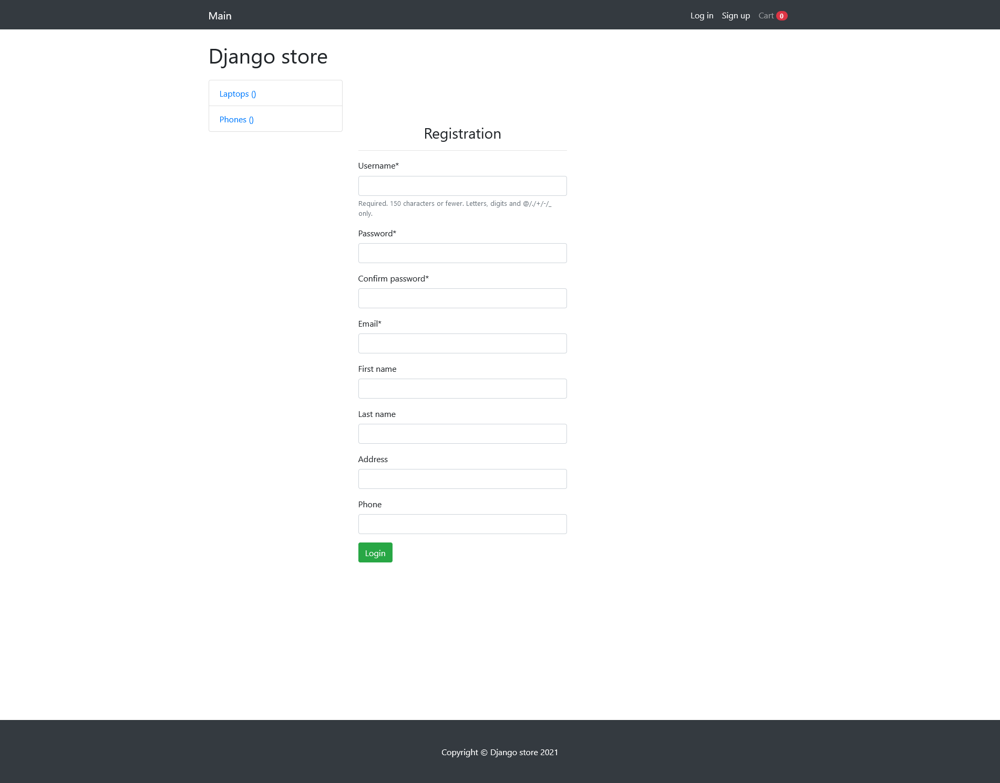
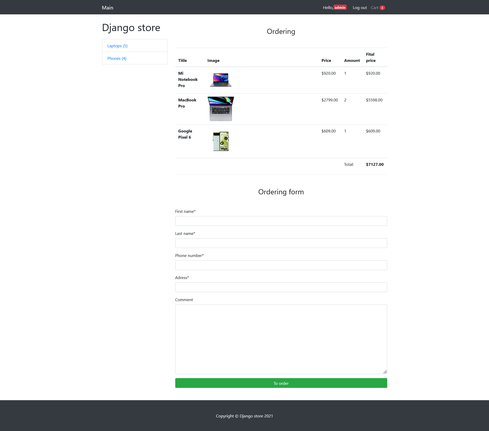

# Shop</br>

My first project in the field of e-commerce. One of my first projects that I created while studying Python and Django.</br>



# Download & Setup Instructions :
* Clone the project. This will download the GitHub respository files onto your local machine.</br>
```Shell
git clone https://github.com/teredet/Shop
```
* Create a virtual environment and activate
```Shell
    pip install virtualenv
    python -m virtualenv envname
    envname\scripts\activate
```
* Install requirements
```Shell
    cd Parser
    pip install -r requirements.txt
```
* Run program
```Shell
    python manage.py runserver
```

# Features
* Category
* Registration, authorization
* Personal account with past orders
* Cart
* Checkout 
# Tech Stack
* Python
* Django
* Pillow

# Main page


# Category page


# Cart page


# Product page


# Registration page


# Order page
